### example0
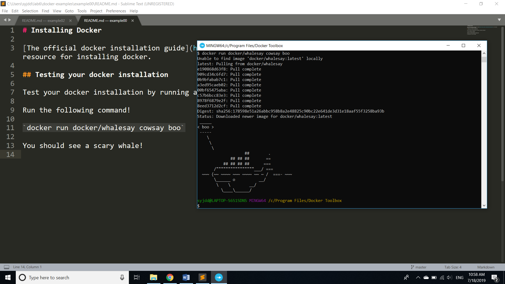
### example1
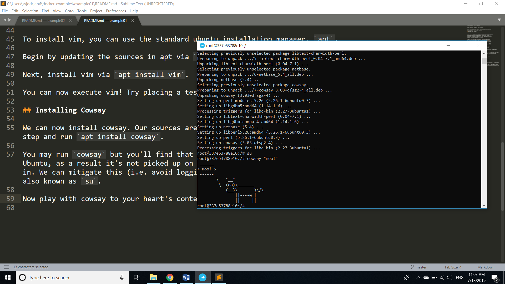
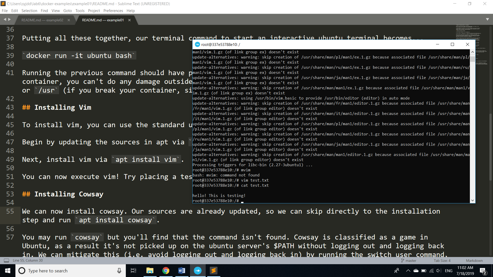
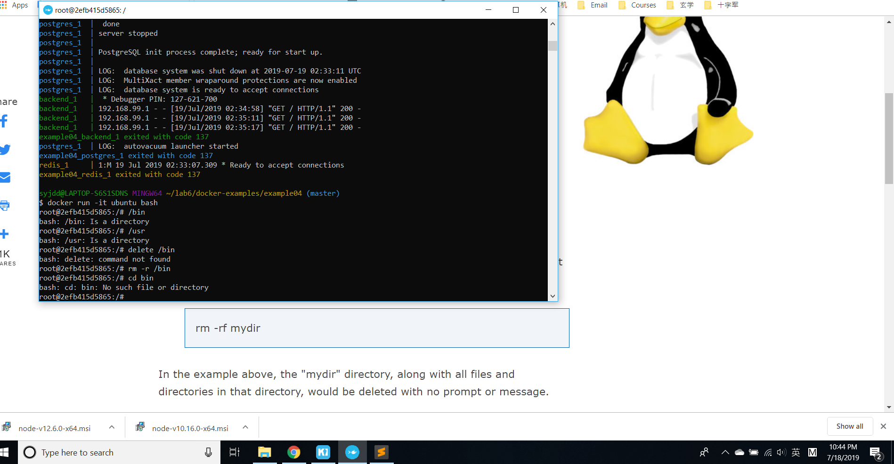
### example2
Seems for windows users, we need to use kitematic to get the real address and port  
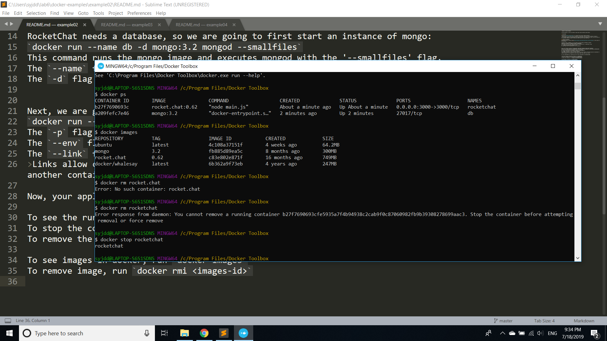
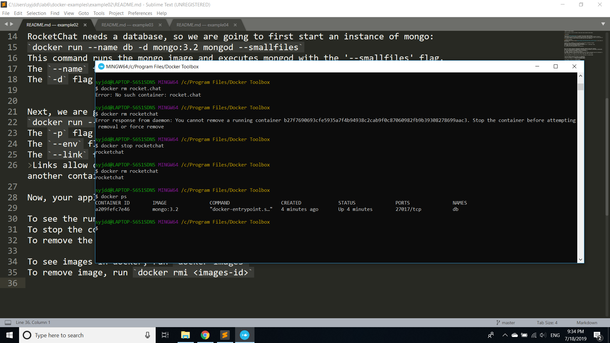
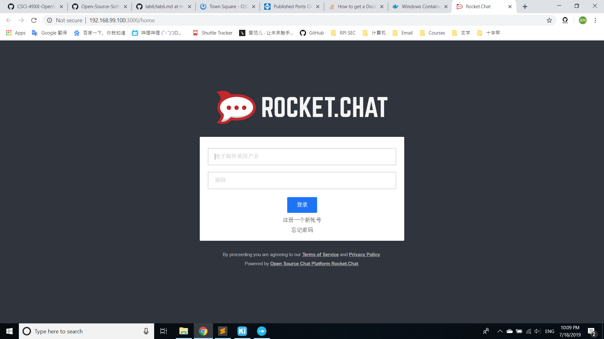
### example3
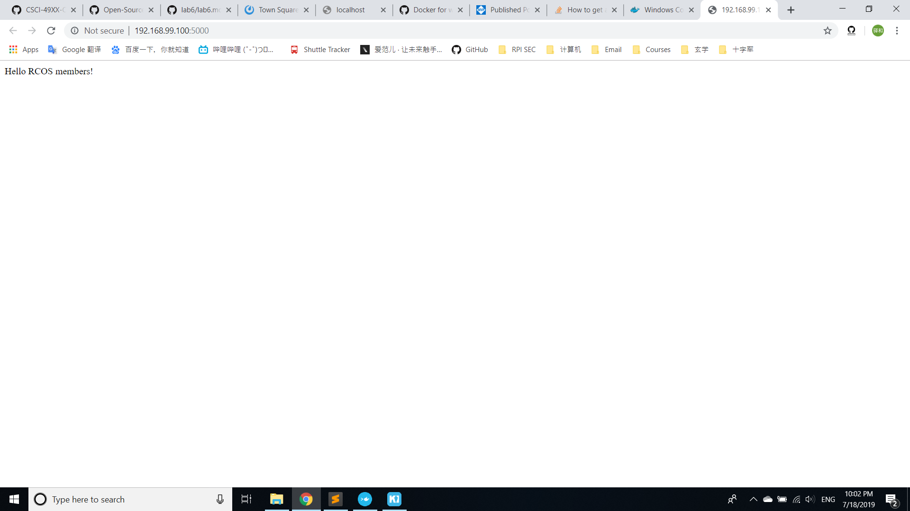
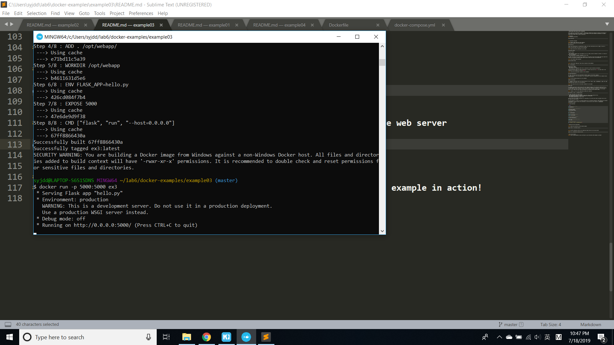
### example4
There are multiple conatiners running in this example, not sure which one is the real container we needed  
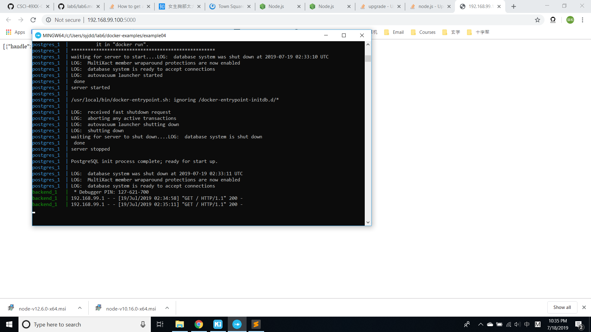
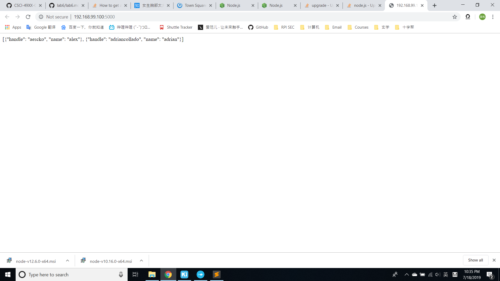
Also, not sure about if we need to update this node.js  
I tried to update this in windows, seems like it doesn't change  
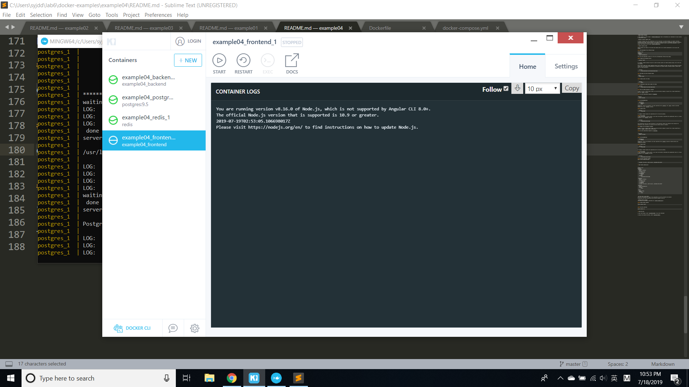
Later I realized that this is the old version of lab  
However, When I tried the new one 
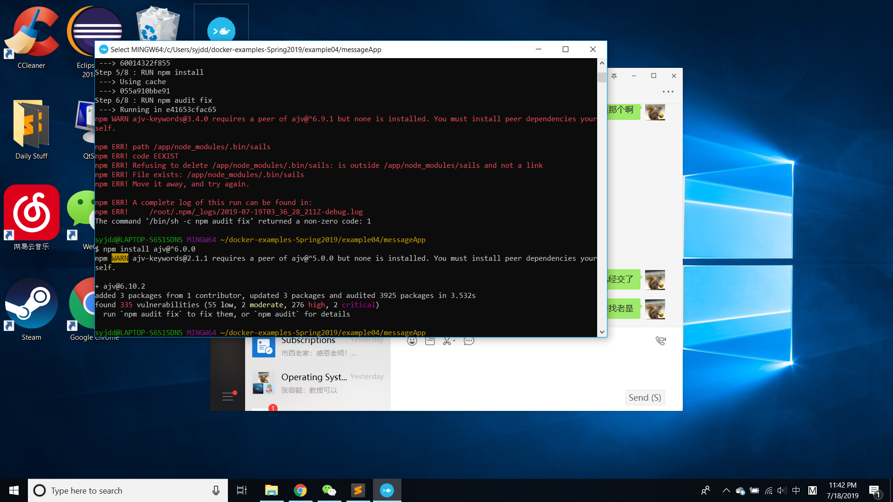
I tried to update, it still goes wrong, maybe because it is windows system...
So I delete the node directory to fixed it, finally  
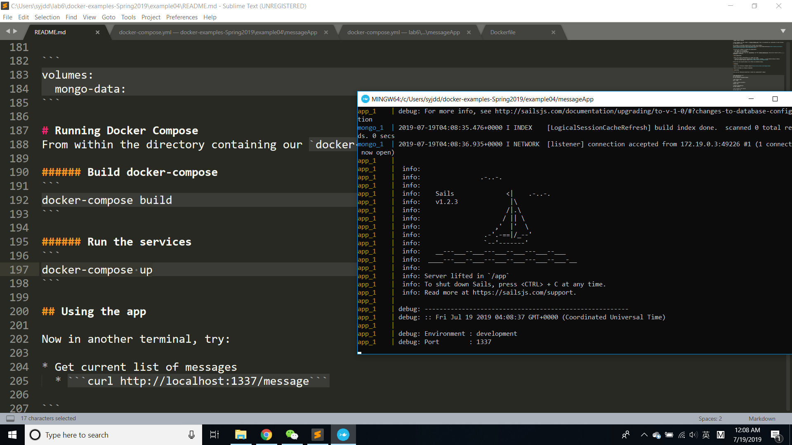
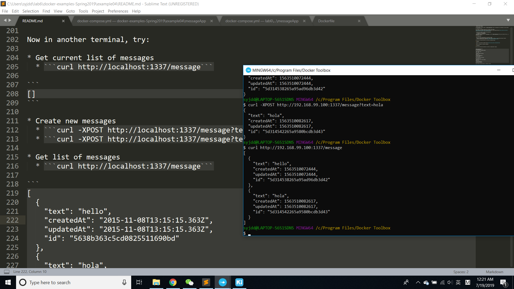
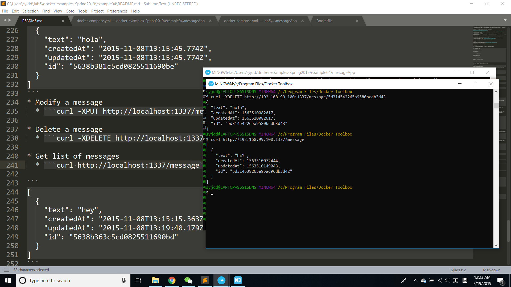
